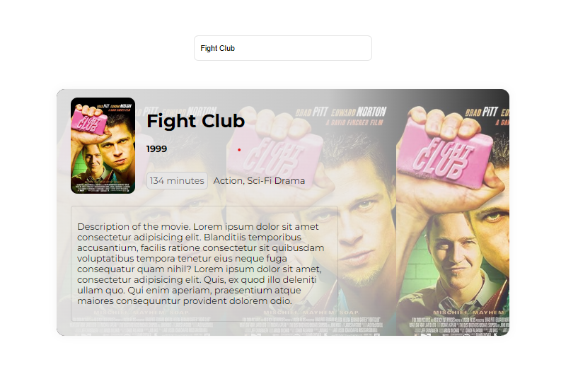

# 🎬 Movie Search App (JavaScript)

A clean, beginner-friendly movie search web app built using **HTML, CSS, and JavaScript**, powered by the **OMDb API**.  
The goal of this project was not just functionality, but **professional file structure, modular code, and graceful data handling**.

---

## 🚀 Features

- 🔍 Search any movie by name
- 🖼 Displays poster, title, and release year
- 🧩 Handles missing or incomplete API data without breaking UI
- 🗂 Organized folder structure (assets, config, src → API + components)
- 🧱 Simple to migrate into React, Vue, or Next.js later

---

## 🛠 Tech Stack

- **HTML**
- **CSS**
- **JavaScript (ES6 Modules)**
- **OMDb REST API**

---

## 🌐 API Used

The project uses the **OMDb API**:  
https://www.omdbapi.com/

> The API returns limited details (only basic data like title, year, and poster in free tier).  
> Since additional fields like full description, director name, cast, and ratings were missing, I **handled the response without crashing the UI**, showing only the available fields.

---

## 📂 Folder Structure

project-root/
│── index.html
│
├── assets/
│   └── screenshot.png
│
├── config/
│   └── config.js
│
├── src/
│   ├── Api/
│   │   └── movies.js
│   │
│   ├── components/
│   │   ├── MovieCard.js
│   │   └── SearchBar.js
│   │
│   └── App.js

## 📸 Screenshot

